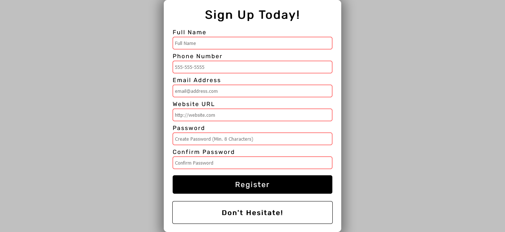

<h1>Form Validation</h1>

<h2>A custom form validation created using HTML, CSS, and JavaScript.</h2>

This form validation using HTML, CSS, and JavaScript allows you to add in your information to see if it is approved or if you need to fix an issue. Screenshot of the website.

- Live Site: [Form Validation](https://form-validation-project.netlify.app/)

### Screenshot

